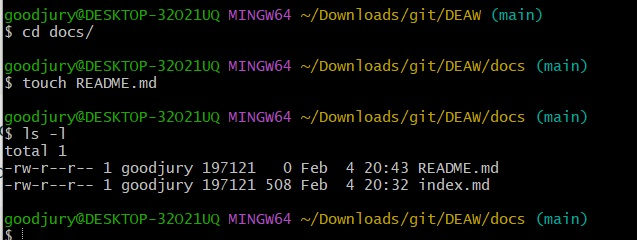
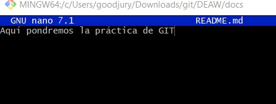
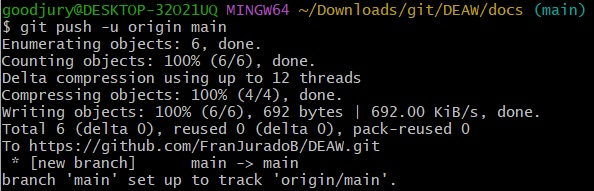
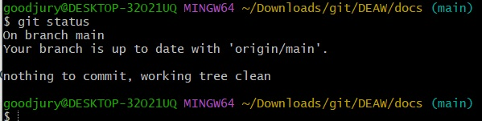
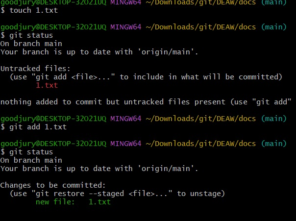
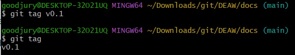

# Ejercicios Git y Github I

## Repositorio DEAW

Crear un repositorio en vuestro GitHub llamado DEAW.


Clonar vuestro repositorio en local.


Le metemos mkdocs instalándolo primero.


Creamos nuevo proyecto.


Podemos modificar el archivo mkdocs.yml con ```nano```


## Readme

Crear en vuestro repositorio local un documento README.md
.




Agregamos el archivo a nuestro repositorio con ```git add .```


## Commit
Realizar un commit inicial con el comentario Comenzamos con los ejercicios de Git


## Push
Subir los cambios al repositorio remoto




## Ignorar archivos
Crear en el repositorio local un fichero llamado privado.txt

Crear en el repositorio local una carpeta llamada privada


Realizar los cambios oportunos para que tanto el archivo como la carpeta sean ignorados por git. 

Debemos crear primero el archivo ```.gitignore``` y lo modificamos poniendo lo que nos interese ocultar:


Vemos que directamente nos lo oculta: 



## Añadir fichero 1.txt
Creamos primero el archivo de texto con ```touch 1.txt``` y comprobamos su estado con ```git status```



Posteriormente lo añadimos con ```git add .```

## Crear un tag y subirlo al repositorio remoto

Ahora creamos una etiqueta con el comando ```git tag "nombre"``` y comprobamos que la ha creado listándola con ```git tag```



Y hacemos commit de dicho cambio: 


## Cuenta de GitHub
Ahora vamos a personalizar la cuenta de GitHub, en cuanto a su apariencia. Concretamente podemos modificar la foto de perfil, que por razones de privacidad no pondré la mía. Nos ceñimos a una imagen cualquiera, pero se puede modificar en la siguiente interfaz.


También podemos modificar el llamado doble-factor de autenticación, para tener una capa extra de protección en nuestra cuenta.


## Uso social de GitHub

Preguntar los nombres de usuario de GitHub de 2 de tus compañeros de clase, búscalos y sígueles.

Seguir los repositorios DEAW del resto de tus compañeros.


Añadir una estrella a los repositorios DEAW del resto de tus compañeros.


## Crear una tabla
Crear una tabla en el fichero README.md con la información básica de los compañeros de clase.


## Colaboradores

Añadir a un compañero de clase como colaborador del repositorio DEAW.


## Crear una rama v0.2 y añadir un fichero 2.txt

Crear una rama v0.2 y cambiar a esa rama.

Con la opción ```git checkout -b v0.2``` creamos la rama y nos cambiamos automáticamente a ella.


Creamos el archivo de texto con ```touch 2.txt``` y lo modificamos con ```nano 2.txt``` y finalmente comprobamos como siempre con ```git status```

## Crear rama remota v0.2

Creamos la rama remota con el comando ```git push -u origin v0.2```


## Merge Directo

Posicionarse en la rama master.

Hacer un merge de la rama v0.2 en la rama master.


## Merge con conflicto

En la rama master poner Hola en el fichero 1.txt y hacer commit.

Posicionarse en la rama v0.2 y poner Adios en el fichero 1.txt y hacer commit.

Posicionarse de nuevo en la rama master y hacer un merge con la rama v0.2


## Listado de ramas


## Arreglar el conflicto


## Listado de ramas

Tenemos varias opciones para ello. Actualmente no me muestra como debería por estar usando window con bash en vez de linux:

