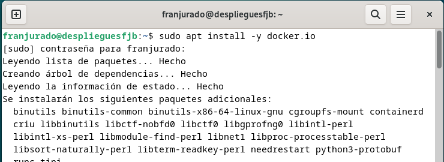

# Práctica 6.1 - Dockerización del despliegue de una aplicación Node.js

## Despliegue con Docker
Empezamos con lo más básico de la práctica, clonar el respectivo repositorio: ```git colne https://github.com/raul-profesor/DAW_practica_6.1_2024.git```


El repositorio contiene todo lo que necesitaremos para más adelante. Se recomienda instalar previamente la herramienta ```curl``` para evitar los problemas que yo he tenido al final.

## Instalación de Docker
Antes de seguir, tenemos que instalar Docker. Para ello usaremos el comando: 
```sudo apt install -y docker.io```



## Archivo Dockfile
Ahora que tenemos instalado Docker nos tenemos que mover al directorio correspondiente y modificar el ```Dockerfile```.
Tenemos que rellenar esos "huecos" libres y que quede de la siguiente forma: 


Donde con lo que completamos hará que:

- ```RUN mkdir -p /opt/app``` : Crea el directorio /opt/app en el contenedor.
- ```WORKDIR /opt/app```: Establece /opt/app como directorio de trabajo.
- ```COPY src/package.json src/package-lock.json ./```: Copia ficheros package.json y package-lock.json desde el src/ al directorio de trabajo.
- ```RUN npm intsall``` : Instala las dependencias de la aplicación.
- ```COPY src/ .``` : Copia el resto del código de la carpeta src/ al contenedor.
- ```EXPOSE 3000``` : Expone el puerto 3000 para que la app se pueda acceder desde fuera del contenedor en sí.
- ```CMD ["npm", "run", "start:dev"]``` : Arranca la aplicación en modo desarrollo.

## Construcción de la imagen

En el contexto actual del directorio de trabajo tenemos que hacer la build de la imagen, con el nombre ```librodirecciones```.


```sudo docker build -t librodirecciones .```

Lo siguiente será iniciar el contenedor en modo demonio, para ponerlo y que escuche las peticiones del puerto 3000 y que coincida con el puerto 3000 del contenedor en sí.

```docker run -p 3000:3000 -d librodirecciones```


Si intentamos acceder a nuestro sitio web con nuestra correspondiente IP, veremos que se produce un error de conexión:
Nuestra ip de la máquina virtual: 


## Docker Compose
Para continuar, instalaremos Docker Compose en nuestro sistema, usando el siguiente comando: 
```sudo apt install docker-compose```


Y comprobamos la versión disponible de éste cuando lo hayamos instalado: 

```docker-compose --version```


Si no estuviese el archivo ```docker-compose.yml``` deberemos crearlo en el directorio raíz de nuestro proyecto, donde hemos clonado el repositorio.

Tendría la siguiente sintaxis: 


Antes de iniciar los contenedores, tenemos que crear una estructura para la base de datos, para ello tenemos que hacer uso del siguiente comando: 

```sudo docker-compose run addressbook nmp run migrate```


Y hecho ésto ya podemos inicializar los contenedores con el comando: ```sudo docker-compose up --build -d```


Ahora podemos hacer un test para comprobar que todo está yendo bien, y nos dará la siguiente salida en la terminal: 


### Paso previo
Para ejecutar los siguientes comando de los ejercicios hay que instalar la herramienta ```curl``` del instalador de paquetes de Debian, Ubuntu o la distribución Linux que estemos utilizando. 
Si la instalamos posteriormente es posible que nos de algún error como el siguiente: 


## Ejercicios


Añade una persona: ```curl -X PUT http://localhost:3000/persons -H'Content-Type: application/json' -d '{"id": 1, "firstName": "Raúl", "lastName": "Profesor"}```

Listar todas las personas: ```curl -X GET http://localhost:3000/persons/all -H 'Content-Type: application/json'```

Buscar una persona por ID: ```curl -X GET http://localhost:3000/persons/1 -H 'Content-Type: application/json'```

Eliminar una persona: ```curl -X DELETE http://localhost:3000/persons/1 -H 'Content-Type: application/json'```


Si todo sale bien deberíamos tener una salida como la siguiente: 
