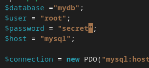

# Práctica 6.2 - Despliegue de una aplicación PHP con Nginx y MySQL usando Docker y Docker-Compose

## Proceso de dockerización de Nginx+PHP+MySQL

Nos podemos conectar mediante SSH a nuestra máquina virtual.

1. Estructura de Directorios
Para comenzar esta práctica, se deberá tener una estructura de directorios similar a la siguiente:

2. Creación de un Contenedor Nginx
Se deberá crear un contenedor Nginx y hacerlo funcionar para que permita alojar la aplicación PHP.

Para ello, primero, se deberá editar el archivo docker-compose.yml con el siguiente contenido:

Y se iniciará el contenedor Nginx y se comprobará que funciona correctamente.

El archivo que se ha creado será el encargado de descargarse la última versión de la imagen de Nginx, crear un contenedor con ella y mapear el puerto 80 del contenedor al puerto 8081 del host.

Si accedemos a la dirección http://localhost:8081 deberá aparecer la siguiente pantalla:

3. Creación de un Contenedor PHP
Editaremos el archivo index.php con el siguiente contenido:

Hecho esto se creará el archivo de configuración default.conf en la carpeta nginx con el siguiente contenido:

server {

     listen 80 default_server;
     root /var/www/html;
     index index.html index.php;

     charset utf-8;

     location / {
      try_files $uri $uri/ /index.php?$query_string;
     }

     location = /favicon.ico { access_log off; log_not_found off; }
     location = /robots.txt { access_log off; log_not_found off; }

     access_log off;
     error_log /var/log/nginx/error.log error;

     sendfile off;

     client_max_body_size 100m;

     location ~ .php$ {
      fastcgi_split_path_info ^(.+.php)(/.+)$;
      fastcgi_pass php:9000;
      fastcgi_index index.php;
      include fastcgi_params;
      fastcgi_param SCRIPT_FILENAME $document_root$fastcgi_script_name;
      fastcgi_intercept_errors off;
      fastcgi_buffer_size 16k;
      fastcgi_buffers 4 16k;
    }

     location ~ /.ht {
      deny all;
     }
    }

Y se modificará el archivo Dockerfile dentro del directorio nginx con el siguiente contenido:

Se deberá modificar el archivo docker-compose.yml con el siguiente contenido:

Con el fichero docker-compose.yml modificado, se creará un contenedor PHP en el puerto 9000 y enlazado con el contenedor Nginx.

Ahora levntaremos los contenedores y comprobaremos que funcionan correctamente.

Si accedemos a la dirección http://localhost:8081 deberá aparecer la siguiente pantalla:

4. Creación de un Contenedor para Datos
            nginx:
                build: ./nginx/
                container_name: nginx-container
                ports:
                    - 80:80
                links:
                    - php
                volumes_from:
                    - app-data

            php:
                image: php:7.0-fpm
                container_name: php-container
                expose:
                    - 9000
                volumes_from:
                    - app-data

            app-data:
                image: php:7.0-fpm
                container_name: app-data-container
                volumes:
                    - ./www/html/:/var/www/html/
                command: "true"

Se deberá crear un contenedor para almacenar los datos. Para ello, se deberá modificar el archivo docker-compose.yml con el siguiente contenido:

Comprobaremos que el contenedor de datos funciona correctamente.

5. Creación de un Contenedor MySQL
Se deberá crear un contenedor MySQL y hacerlo funcionar para que permita alojar la base de datos de la aplicación PHP.

Para ello, se deberá modificar el archivo Dockerfile del directorio php con el siguiente contenido:

Se deberá modificar el archivo docker-compose.yml con el siguiente contenido:

Se deberá modificar el archivo index.php con el siguiente contenido:

Se comprueba que el contenedor MySQL funciona correctamente con los comandos ya vistos anteriormente.

6. Verificación de Conexión a la Base de Datos
Si se accede a la dirección http://localhost:8081 deberá aparecer la siguiente pantalla:

Pero si se modifica el archivo index.php con el siguiente contenido:

    $user = 'root';
    $password = 'secret';

Y deberá quedar de la siguiente manera:

Si se accede a la dirección http://localhost:8081 deberá aparecer la siguiente pantalla:

Con esto se comprueba que la aplicación PHP se conecta correctamente a la base de datos MySQL.

Y con esto se finaliza la práctica.

7. Esquema de la Aplicación

