# Práctica 6.3 - Despliegue de servidores web con usuarios autenticados mediante LDAP usando Docker y docker-compose

## Despliegue con Docker de NGINX + demonio de autenticación LDAP + OpenLDAP

Empezamos creando los archivos necesarios para la práctica. 
Es importante comprobar el arbol de documentos, en mi caso he tenido que instalar ```tree```.

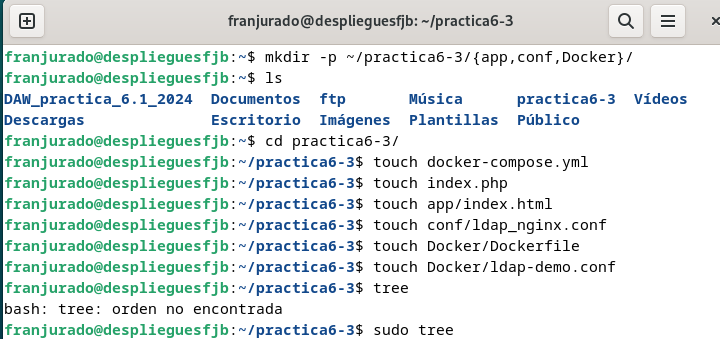

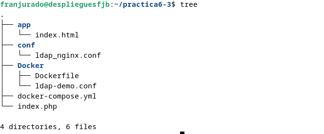

Dentro del directorio app se deberá crear un archivo index.html con el siguiente contenido. Lo hacemos sin usar el comando ```nano```

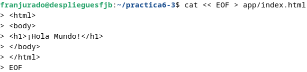

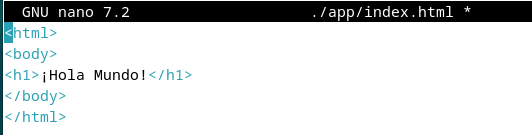

Tras hacer esto creamos el archivo ldap_nginx.conf y su configuración:


    $ cat << EOF > conf/ldap_nginx.conf
        server {
        listen 8082;

        location = / {
            auth_request /auth-proxy;
        }

        location = /auth-proxy {
            internal;

            proxy_pass http://nginx-ldap:8888;

            # URL y puerto para conectarse al servidor LDAP
            proxy_set_header X-Ldap-URL "ldap://openldap:1389";

            # Base DN
            proxy_set_header X-Ldap-BaseDN "dc=example,dc=org";

            # Bind DN
            proxy_set_header X-Ldap-BindDN "cn=admin,dc=example,dc=org";

            # Bind password
            proxy_set_header X-Ldap-BindPass "adminpassword";
        }
    }
    EOF


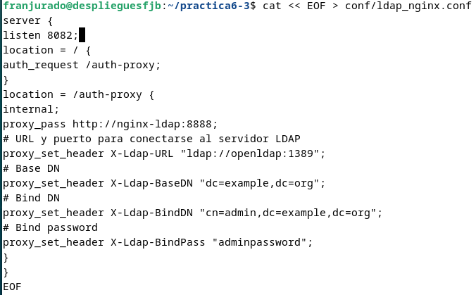

En la configuración anterior se ha establecido que Nginx escuche en el puerto 8082 para no tener problemas de que esté ocupado. Además, se ha configurado una autenticación para el directorio /auth-proxy, especificando la URL del servidor OpenLDAP (usando el nombre del contenedor Docker), el DN base para las búsquedas y las credenciales de acceso para realizar las consultas.

Hecho esto, se creará un archivo docker-compose.yml con el siguiente contenido:

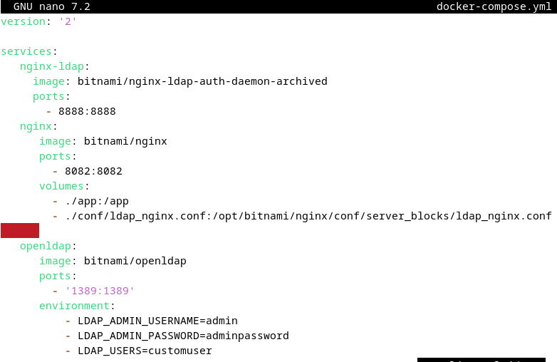

Con el archivo docker-compose.yml creado, se levantarán los contenedores y se comprobará que funcionan correctamente.

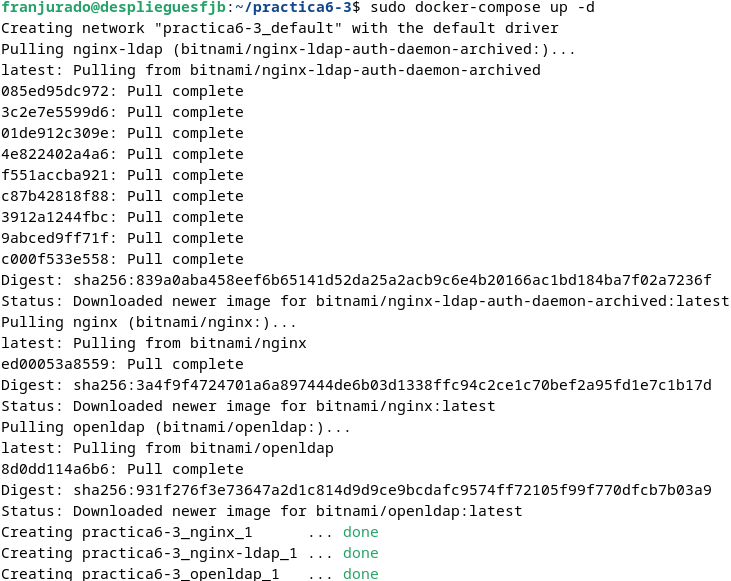

Si accedemos a la dirección http://tu-ip:8082 deberá aparecer la siguiente pantalla:

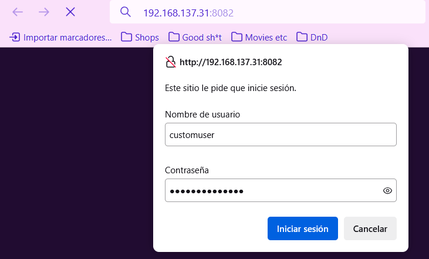

Introducimos las credenciales que usamos anteriormente. Usuario ```customuser``` y contraseña ```custompassword``` en este caso.

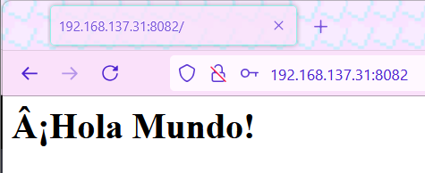

## Despliegue con Docker de PHP + Apache con autenticación LDAP

Ahora modificaremos el archivo index.php con el siguiente contenido:

    <?php
    echo 'Ey, hola usuario autenticado por LDAP!';
    ?>

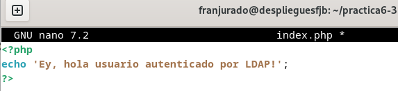

Luego, modificamos el archivo Dockerfile del directorio Docker, donde los espacios se cambiarán por los comandos pertinentes:

        ./Docker/Dockerfile --> directorio donde se encuentra este archivo

        Imagen base sobre la que vamos a trabajar
        ____ php:7-apache

        Activamos el módulo LDAP de Apache ejecutand el siguiente comando
        ____ a2enmod authnz_ldap

        Añadimos las reglas/configuración de LDAP al directorio conf-enabled de Apache
        (crearemos este archivo en el siguiente paso)
        ____ Docker/ldap-demo.conf /etc/apache2/conf-enabled/

        Añadimos ayuda de depuración (debugging) en la configuración de apache
        En caso de necesitarlo, lo descomentamos para ejecutar el siguiente comando
        ____ echo "LogLevel debug" >> apache2.conf

        Establecemos el directorio de trabajo adecuado
        ____ /var/www/html/demo


        Configuramos Apache para usar la configuración ldap definida arriba, la copiamos de nuestro ordenador al contenedor
        ____ Docker/.htaccess ./.htaccess

        Copiamos los archivos del proyecto que necesitamos, al contenedor

        ____ index.php ./


También modificamos el archivo ldap-demo.conf en Docker:

            ./Docker/ldap-demo.conf
            PassEnv LDAP_BIND_ON
            PassEnv LDAP_PASSWORD
            PassEnv LDAP_URL
            <AuthnProviderAlias ldap demo>
                AuthLDAPBindDN ${LDAP_BIND_ON}
                AuthLDAPBindPassword ${LDAP_PASSWORD}
                AuthLDAPURL ${LDAP_URL}
            </AuthnProviderAlias> 

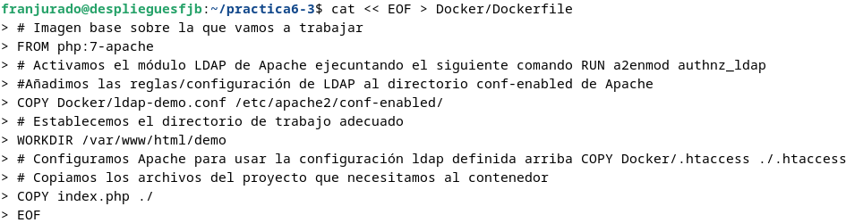

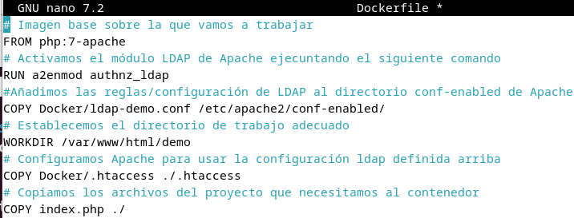

Y el archivo htaccess se modificará con lo siguiente:

        cat << EOF > Docker/.htaccess
        AuthBasicProvider demo
        AuthType Basic
        AuthName "Protected Area"
        Require valid-user
        EOF

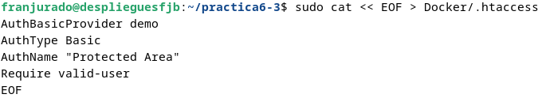

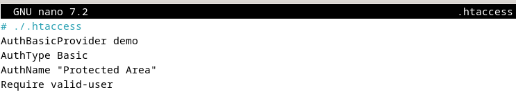

Si todo ha salido bien hasta ahora, se podrá ejecutar el siguiente comando para construir una imagen:

```sudo docker build . -t docker-ldap -f ./Docker/Dockerfile```

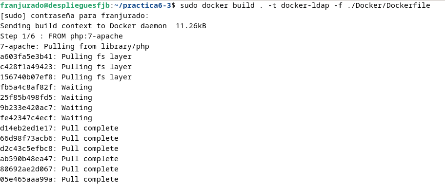

Y si también ha salido bien, ejecutaremos un comando para levantar el contenedor pertinente:

sudo docker run -p 3000:80 --name ldap_demo \
    -e LDAP_BIND_ON="uid=admin,cn=users,cn=accounts,dc=demo1,dc=freeipa,dc=org" \
    -e LDAP_PASSWORD="Secret123" \
    -e LDAP_URL="LDAP://ipa.demo1.freeipa.org" \
    docker-ldap

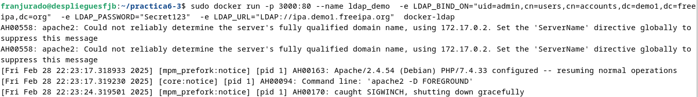

Por último comprobamos que si entramos en la dirección http://nuestra-ip:8082/demo, debería preguntarnos para iniciar sesión, entrando esta vez con usuario ```admin``` y contraseña ```Secret123```.

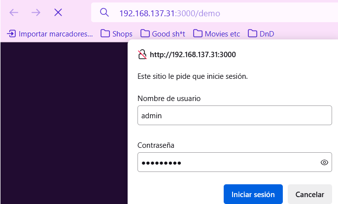

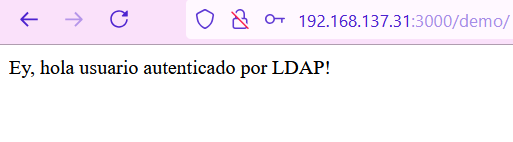


Y con ello, se acaba la práctica.
